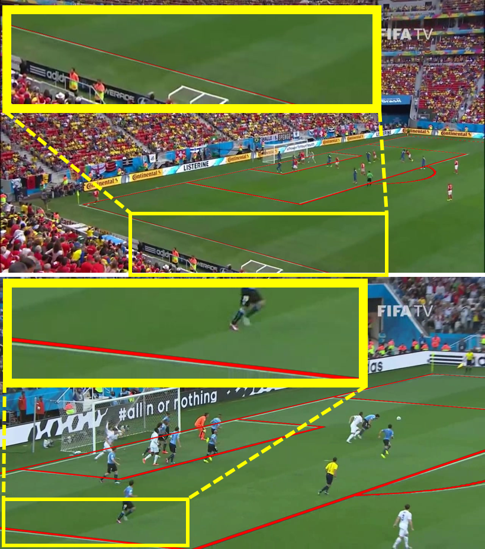

# Sports Field Registration via Keypoints-aware Label Condition

This is an official implementation of Sports Field Registration via Keypoints-aware Label Condition.

Yen-Jui Chu, Jheng-Wei Su, Kai-Wen Hsiao, Chi-Yu Lien, Shu-Ho Fan, 
Min-Chun Hu1, Ruen-Rone Lee, Chih-Yuan Yao, Hung-Kuo Chu

8th International Workshop on Computer Vision in Sports (CVsports) at CVPR 2022

### [[Paper](https://cgv.cs.nthu.edu.tw/KpSFR_data/KpSFR_paper.pdf)] [[Webpage](https://ericsujw.github.io/KpSFR/)]

<p align='center'>

</p>

We propose a novel deep learning framework for sports field registration. The typical algorithmic flow for sports field registration involves extracting field-specific features (e.g., corners, lines, etc.) from field image and estimating the homography matrix between a 2D field template and the field image using the extracted features. 
Unlike previous methods that strive to extract sparse field features from field images with uniform appearance, we tackle the problem differently. 
First, we use a grid of uniformly distributed keypoints as our field-specific features to increase the likelihood of having sufficient field features under various camera poses. Then we formulate the keypoints detection problem as an instance segmentation with dynamic filter learning. 
In our model, the convolution filters are generated dynamically, conditioned on the field image and associated keypoint identity, thus improving the robustness of prediction results. 
To extensively evaluate our method, we introduce a new soccer dataset, called TS-WorldCup, with detailed field markings on 3812 time-sequence images from 43 videos of Soccer World Cup 2014 and 2018. The experimental results demonstrate that our method outperforms state-of-the-arts on the TS-WorldCup dataset in both quantitative and qualitative evaluations.


## Requirements
- CUDA 11
- Python >= 3.8
- Pytorch == 1.9.0
- torchvision == 0.9.0
- Numpy
- OpenCV-Python == 4.5.1.48
- Matplotlib
- Pillow/scikit-image
- Shapely == 1.7.1
- tqdm

## Getting Started
1. Clone this repo:
```sh
git clone https://github.com/ericsujw/KpSFR
cd KpSFR/
```
2. Install [miniconda](https://docs.conda.io/en/latest/miniconda.html)
3. Install all the dependencies
```sh
conda env create -f environment.yml
```
4. Switch to the conda environment
```sh
conda activate kpsfr
```

## Pretrained Models
1. Download [pretrained weight on WorldCup dataset](https://cgv.cs.nthu.edu.tw/KpSFR_data/model/kpsfr.pth).
2. Now the pretrained models would place in [checkpoints](checkpoints).
3. Download public [WorldCup](https://nhoma.github.io/) dataset.
4. Download [TS-WorldCup](https://cgv.cs.nthu.edu.tw/KpSFR_data/TS-WorldCup.zip) dataset.
5. Now the WorldCup dataset would place in [dataset/soccer_worldcup_2014](dataset/soccer_worldcup_2014) and TS-WorldCup in [dataset/WorldCup_2014_2018](dataset/WorldCup_2014_2018).

## Inference

Please use [robust](robust) model first to get the preprocess results before running the inference command below.

### Inference command
```python
python inference.py <path/param_text_file>
```
param_text_file as follows,
- `inference.txt`: download [pretrained weight on WorldCup dataset](https://cgv.cs.nthu.edu.tw/KpSFR_data/model/kpsfr.pth) or [pretrained weight on TS-WorldCup dataset](https://cgv.cs.nthu.edu.tw/KpSFR_data/model/kpsfr_finetuned.pth) first and place in [checkpoints](checkpoints). For inference on your own data.
	- `target_video`:  specify the target video, use space to split multiple video, and set `--train_stage` to **1**, `--sfp_finetuned` to **True** and `--ckpt_path` to the corresponding model finetuned weight.
	- `target_image`:  specify the target image, use space to split multiple image, and set `--train_stage` to **0**, `--sfp_finetuned` to **False** and `--ckpt_path` to the corresponding model weight.

Note:
- In the current implementation, we could only infer on WorldCup or TS-WorldCup test set.
- Input index of the corresponding image when specify `target_image`.
- Input format for specifying `target_video` to refer to the [text file](dataset/WorldCup_2014_2018/test.txt).
- Execute and output all testing data if not specify target image or video.

## Evaluation

Please use [robust](robust) model first to get the preprocess results before running the evaluation command below.

### Evaluation command
```python
python eval_testset.py <path/param_text_file>
```
param_text_file as follows,
- `exp_ours.txt`: download [pretrained weight on WorldCup dataset](https://cgv.cs.nthu.edu.tw/KpSFR_data/model/kpsfr.pth) first and place in [checkpoints](checkpoints). Set `--train_stage` to **0** for testing on WorldCup test set or set `--train_stage` to **1** on TS-WorldCup test set and set `--sfp_finetuned` to **False**.
- `exp_our_finetuned.txt`: download [pretrained weight on TS-WorldCup dataset](https://cgv.cs.nthu.edu.tw/KpSFR_data/model/kpsfr_finetuned.pth) first and place in [checkpoints](checkpoints). Set `--train_stage` to **1** and `--sfp_finetuned` to **True** for testing finetuned results on TS-WorldCup test set.
- `exp_our_dice_bce.txt`: download [pretrained weight](https://cgv.cs.nthu.edu.tw/KpSFR_data/model/kpsfr_dicebceloss.pth) first and place in [checkpoints](checkpoints). Set `--train_stage` to **1** for ablation study of loss function (binary dice loss with binary cross entropy loss) on TS-WorldCup test set.
- `exp_our_dice_wce.txt`: download [pretrained weight](https://cgv.cs.nthu.edu.tw/KpSFR_data/model/kpsfr_dicewceloss.pth) first and place in [checkpoints](checkpoints). Set `--train_stage` to **1** for ablation study of loss function (binary dice loss with weighted cross entropy loss) on TS-WorldCup test set.

We will save heatmap results and corresponding homography matrix into **/checkpoints/path of experimental name**, which set `--name` in param_text_file.

## Train model
### Train command
```python
python train_nn.py <path/param_text_file>
```
param_text_file as follows,
- `opt_ours.txt`: download [pretrained weight on WorldCup dataset](https://cgv.cs.nthu.edu.tw/KpSFR_data/model/kpsfr.pth) first and place in [checkpoints](checkpoints). Set `--train_stage` to **0**, `--trainset` to **train_val** and `--loss_mode` to **all** for training on WorldCup train set. For ablation study, download [pretrained weight on TS-WorldCup dataset](https://cgv.cs.nthu.edu.tw/KpSFR_data/model/kpsfr_finetuned.pth) first and place in [checkpoints](checkpoints). Set `--loss_mode` to **dice_bce** or **dice_wce**.
- `opt_our_finetuned.txt`: download [pretrained weight on TS-WorldCup dataset](https://cgv.cs.nthu.edu.tw/KpSFR_data/model/kpsfr_finetuned.pth) first and place in [checkpoints](checkpoints). Set `--train_stage` to **1**, `--trainset` to **train** and `--loss_mode` to **all** for finetuning on TS-WorldCup train set.

We will save visualize results and weights into **/checkpoints/path of experimental name**, which set `--name` in param_text_file.

Note: Please check the following arguments to set correct before training every time.
- `--gpu_ids`
- `--name`
- `--train_stage` and `--trainset`
- `--ckpt_path`
- `--loss_mode`
- `--train_epochs` and `--step_size`

Details refer to [options.py](options.py).

## License
This work is licensed under MIT License. See [LICENSE](LICENSE) for details. 

## Citation
If you find our code/models useful, please consider citing our paper:
```
@InProceedings{Chu_2022_CVPR,
    author    = {Chu, Yen-Jui and Su, Jheng-Wei and Hsiao, Kai-Wen and Lien, Chi-Yu and Fan, Shu-Ho and Hu, Min-Chun and Lee, Ruen-Rone and Yao, Chih-Yuan and Chu, Hung-Kuo},
    title     = {Sports Field Registration via Keypoints-Aware Label Condition},
    booktitle = {Proceedings of the IEEE/CVF Conference on Computer Vision and Pattern Recognition (CVPR) Workshops},
    year      = {2022}
}
```